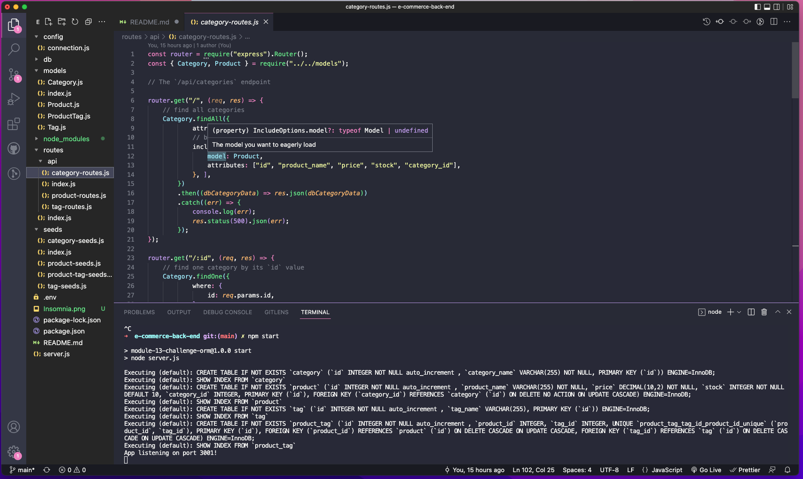
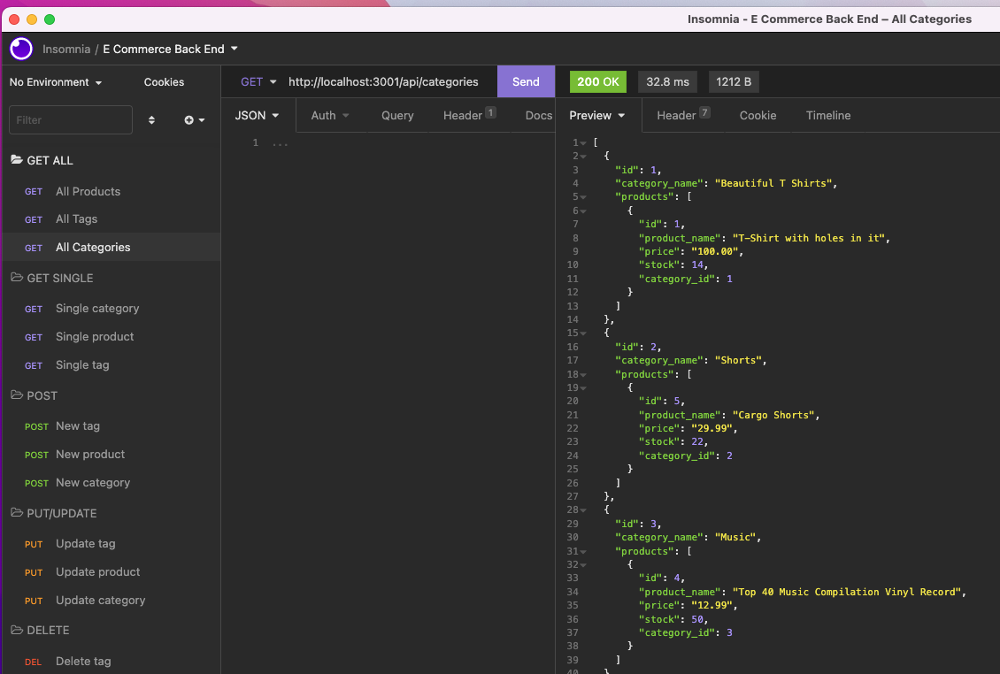

# E-Commerce Back End

## Description

The purpose of this project was to learn how to create a MySQL database and back end for an E-Commerce site. Note that there is no front end code in this repository.

## Table of Contents

- [Installation](#installation)
- [Usage](#usage)
- [License](#license)
- [Contributions](#contributions)
- [Testing](#testing)
- [Questions](#questions)

## Installation

Installation requires npm, mysql2, sequelize, dotenv, Heroku and JAWS DB, and other dependencies. Contact me for further installation instructions.

## Usage

Here's a link to a video showing basic operation: [Google Drive Link](https://drive.google.com/file/d/1ylperNHKn_cv3WDm-iDpR9GWfrwJOoNi/view)

## License

Copyright © 2022 [Caren Merz](https://github.com/cammeer).  
This project is [MIT](https://github.com/cammeer/next-progress-bar/blob/main/LICENSE) licensed.

## Contributions

I was the only contributor for this project so far. If you would like to contribute, see my email below.

## Tech

- JavaScript
- Node.js
- MySQL
- Heroku
- JawsDB MySQL

## Testing

Testing for Get/Put/Post routes was conducted via [Insomnia](https://insomnia.rest/)

## Any Questions?

This project was created by me: [cammeer](https://github.com/cammeer)

Contact me with any questions at: [caren@merzhaus.org](caren@merzhaus.org)
